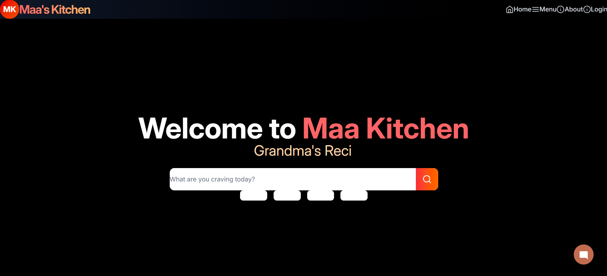
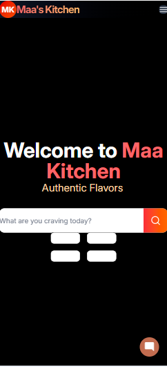
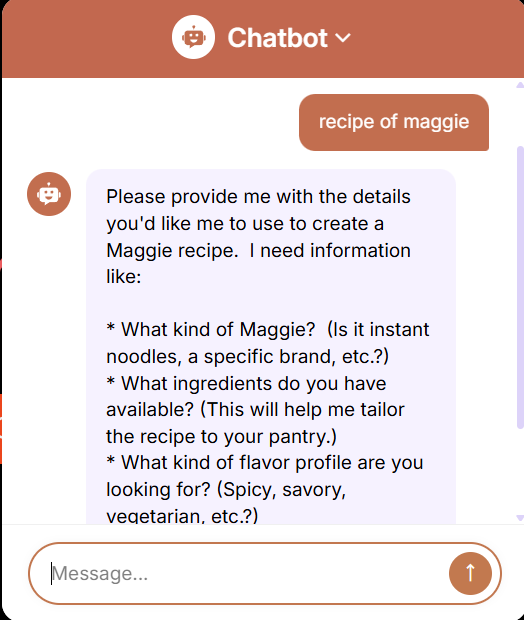
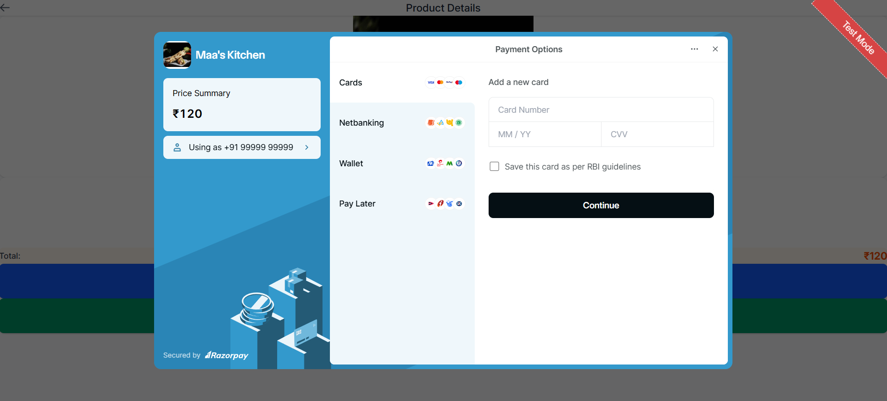

# 🧑‍🍳 Maakitchen: AI-Enhanced Culinary Platform

> Maakitchen is a full-stack food-tech application built for food lovers and creators. It blends AI-powered recipe generation, secure transactions, and beautiful UI for a seamless kitchen experience.

---

## 📸 Project Showcase

*MaaKitchen UI*

*MaaKitchen mobile UI*

*Generate Recipe*

*Payment Checkout*

---

## 🌟 Key Features

### 🍳 AI-Powered Cooking Assistant
- Smart recipe suggestions using **Google Generative AI**
- Ingredient-based dynamic recipe generation
- Personalized cooking guidance

### 🔐 Secure Authentication & Validation
- JWT-based token authentication
- Password hashing with **bcryptjs**
- Schema validation using **Joi**

💸 Razorpay Payment Integration – Fast, Secure & Scalable

       ⚡ Lightning-fast checkout experience with Razorpay’s seamless UI
        
        🏦 Accepts cards, wallets, and net banking effortlessly
    
        🧾 Auto-generates secure order IDs and receipts

        🔐 Server-side verification using Razorpay Node SDK + Express
 
        📊 Real-time payment status tracking and error handling

        💼 Perfectly suited for paid recipes, subscriptions, or cooking classes

🎨 Stunning UI/UX

    Built with React.js, Chakra UI, and Tailwind CSS

    Responsive, mobile-first design
    
    Animations via Framer Motion and Motion

🔥 Realtime & Cloud Support

    storage and real-time features
    
    Typed.js for dynamic header effects
    
    Icon-rich design with Tabler Icons & React Icons

🧠 Technology Stack
| Layer        | Technologies                                             |
| ------------ | -------------------------------------------------------- |
| **Frontend** | React.js, Chakra UI, TailwindCSS, Framer Motion |
| **Backend**  | Express.js, Node.js, MongoDB, Mongoose                   |
| **AI/ML**    | Google Generative AI API                                 |
| **Payments** | Razorpay                                                 |
| **Security** | JWT, bcryptjs, Joi                                       |

🔒 Security Highlights

✅ JWT authentication with expiry

✅ Passwords hashed with bcryptjs

✅ Environment secrets managed via .env

✅ CORS-protected API routes

✅ Input validation using joi schemas

🗺 Roadmap

🚧 Phase 1 – Core Launch

   AI recipe assistant

   Razorpay integration

   real-time storage

   JWT auth system

   Chakra UI theming

🚀 Phase 2 – Upcoming Enhancements

   User dashboards with meal plans

   Voice assistant integration

   Recipe sharing via social links

   Shopping list generator

 

